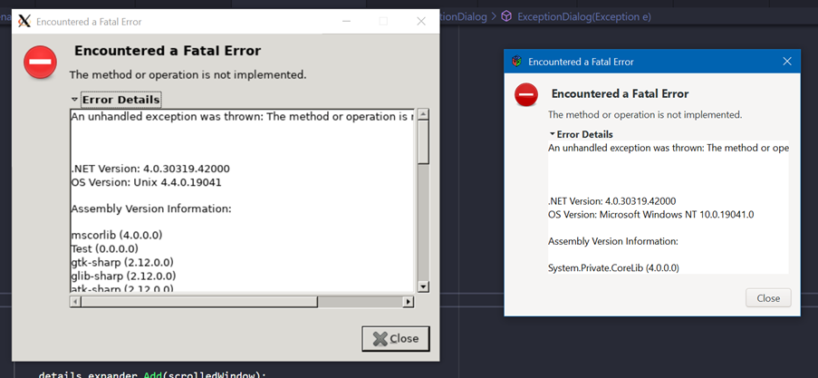

# Hyena


A utility library primarily used by Banshee.

This is an attempt at porting Hyena to .NET Core and removing mono
from the codebase. Additionally, it has evolved to contain an experimental
(READ: *very experimental*) port to Gtk3 using the gir.core bindings.

Please note, this port is *very* incomplete and much of it
does not compile. The `Hyena.Tests` directory doesn't actually
work, and is just a dumping ground for now. I will look at rewriting
the tests for NUnit 3 in the future.

See `TODO.md` for current status.

## Demo: ExceptionDialog
The first example of a widget ported from gtk-sharp (Gtk2) to gir.core (Gtk3). Note that the Gtk2 dialog is running on WSL via VcXsrv, hence the size of the window.




This dialog takes a C# exception and generates a user-facing dialog with
information about the cause of the problem. There are some slight changes,
such as the omission of the 'X' on the close button, but otherwise they are
very much the same, even in parts of the source code. It has been updated to
use modern CSS Styling.

## Building
You're on your own :)

A typical build might look as follows:

```
# Get repository and *recursively* init submodules (we need ext/gir.core/gir-files)
> git clone https://github.com/firox263/Hyena.git
> git submodule update --init --recursive

# Run the binding generation tool
> pushd ext/gir.core/Build
> dotnet run

# Return to Hyena directory and build
> popd
> dotnet build

# Run Gui code tests:
> dotnet run --project Hyena.Gui
```

`Hyena.Gui.Old` contains Mono/Gtk2 code and no longer builds. `Hyena`, `Hyena.Data.Sqlite`, and `Hyena.Gui` all build using .NET Core 3.1.

Make sure you have a compatible version of Gtk installed (see gir.core for setup instructions).

You can run with `dotnet run --project=Hyena.Gui`.

## Original README
The original README can be seen below:

```txt
This is a library of useful GUI and non-GUI C# code, originally used in Banshee.

NOTE
** It is not API stable, and so is not installed to the GAC.**

There are three ways to use Hyena in your app:

1) Require it as an external dep; copy its .dll files into your project

   Applications using it should make a local copy of whatever components you use.
   That is, you should consider Hyena a build-time dependency, not a run-time, since
   at run-time your app will contain a copy of Hyena.

   There are variables defined in the pkg-config files that contain assemblies 
   and files needed for a given component of Hyena (eg hyena, hyena.data.sqlite, 
   and hyena.gui).

   pkg-config --variable=Assemblies hyena
   pkg-config --variable=Files hyena
   
   You can look at PDF Mod for an example of how to use Hyena:

   http://git.gnome.org/cgit/pdfmod/tree/configure.ac
   http://git.gnome.org/cgit/pdfmod/tree/Makefile.am
   http://git.gnome.org/cgit/pdfmod/tree/src/Makefile.am

2) Include it as a submodule in your git repo

   This is advantageous if you want to closely track and maybe contribute
   back to Hyena.  It also means developers don't have to install Hyena
   themselves from packages or git.

     git submodule add git://git.gnome.org/hyena lib/Hyena
     git submodule update --init
     git add .gitmodules

   Then you'll need to add Hyena to your build system.  See Banshee's setup:

     http://git.gnome.org/cgit/banshee/tree/configure.ac
     http://git.gnome.org/cgit/banshee/tree/Makefile.am

   You can also include the appropriate .csproj in your .sln.  Set them to
   build under the 'Submodule' configuration, and the binaries will get
   outputted to ../../bin from the Hyena checkout directory.

3) Bundle the .dll files in your project

   It's an expedient, but not good form for FOSS projects.
```
